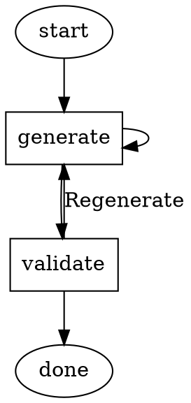

# Goal Gates

Goal gates are critical success criteria that must be satisfied before a pipeline can complete. They enforce that the pipeline doesn't just reach the exit node — it achieves its objectives.

## Semantics

A node with `goal_gate=true` is a goal gate:

```dot
implement_auth [shape=box goal="Implement authentication" goal_gate=true]
all_tests_pass [shape=box goal="All tests passing" goal_gate=true]
```

**The pipeline cannot exit until every goal gate node has reached `SUCCESS` status.**

If the traversal reaches the exit node but unsatisfied goal gates remain, the engine does not finalize — instead, it routes back to address the unsatisfied gates.

## Terminal Node Enforcement

At the finalization phase (Phase 5 of the [execution lifecycle](execution-engine.md)):

1. Engine checks all nodes with `goal_gate=true`
2. For each gate, checks whether its most recent outcome was `SUCCESS`
3. If all gates are satisfied → pipeline completes successfully
4. If any gate is unsatisfied → re-routing occurs

## Retry Routing for Unsatisfied Gates

When the engine reaches the exit node with unsatisfied gates:

1. **Identify** the unsatisfied gate nodes
2. **Check** if any have a `retry_target` attribute
3. **Route** to the retry target of the first unsatisfied gate (by graph order)
4. If no retry target exists, **route** back to the unsatisfied gate node itself
5. If the gate has exhausted its `max_retries`, the pipeline **terminates with FAILURE**

This creates an automatic "keep trying until it works" loop:



Here, both `generate` and `validate` are goal gates. Even if `validate` routes back to `generate`, the pipeline won't complete until both nodes have achieved `SUCCESS`.

## Goal Gates vs Regular Nodes

| Aspect | Regular Node | Goal Gate Node |
|--------|-------------|----------------|
| Must succeed for pipeline completion | No | Yes |
| Failure triggers automatic re-routing | Only via explicit edges | Yes (at finalization) |
| Tracked in checkpoint | Outcome only | Outcome + satisfaction status |
| Can be skipped | Yes (via routing) | No (must be visited and succeed) |

## Multiple Goal Gates

Pipelines can have any number of goal gates. All must be satisfied. The engine tracks each independently — satisfying one gate doesn't affect the others.

## Goal Gate Status in Context

The engine maintains goal gate status in the context under `_goal_gates`:

```python
context["_goal_gates"] = {
    "implement_auth": "SUCCESS",    # Satisfied
    "all_tests_pass": "PENDING",    # Not yet visited or not yet succeeded
}
```

Edge conditions can reference this to create routing logic that depends on overall pipeline progress.

## See Also

- [execution-engine.md](execution-engine.md) — Finalization phase where gates are checked
- [retry-and-failure.md](retry-and-failure.md) — Retry mechanics for unsatisfied gates
- [checkpoints-and-resume.md](checkpoints-and-resume.md) — Goal gate status in checkpoints
