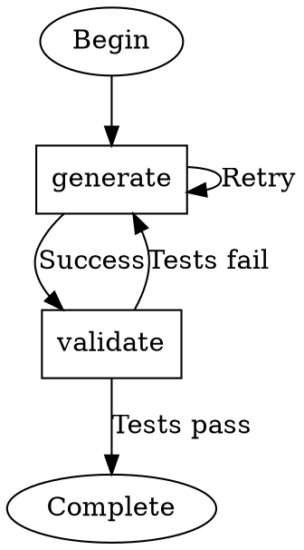
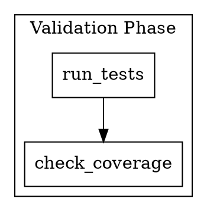

# Graph Definition

Attractor pipelines are defined using a subset of the Graphviz DOT language — a plain-text format for describing directed graphs.

## DOT DSL Subset

Attractor uses `digraph` (directed graph) declarations. The supported subset includes:



## Structure Elements

### Graph Declaration

Every pipeline is a `digraph` with a name. The name is used for identification in logs and checkpoints.

### Graph-Level Attributes

Set via `graph [key=value ...]`:

| Attribute | Purpose |
|-----------|---------|
| `title` | Human-readable pipeline name |
| `version` | Pipeline version string |
| `model_stylesheet` | Path to or inline CSS-like model configuration |
| `default_fidelity` | Default context fidelity mode for all edges |

### Node Attributes

Nodes are declared by name with optional `[key=value]` attributes:

| Attribute | Purpose | Example |
|-----------|---------|---------|
| `shape` | Determines which handler executes this node | `shape=box` (codergen) |
| `goal` | The task description passed to the handler | `goal="Implement auth module"` |
| `label` | Display name (used in visualization and logs) | `label="Auth"` |
| `goal_gate` | Whether this node is a critical success gate | `goal_gate=true` |
| `max_retries` | Maximum retry attempts on failure | `max_retries=3` |
| `retry_target` | Node to route to on retry | `retry_target=fix_errors` |
| `class` | CSS-like class for model stylesheet targeting | `class=validation` |

### Edge Attributes

Edges use `->` syntax with optional attributes:

| Attribute | Purpose | Example |
|-----------|---------|---------|
| `label` | Display label and human-interaction accelerator | `label="[Y] Yes"` |
| `condition` | Expression evaluated against node outcome | `condition="status == 'SUCCESS'"` |
| `weight` | Priority for edge selection (higher = preferred) | `weight=10` |
| `fidelity` | Context fidelity mode for this transition | `fidelity=compact` |

### Chained Edges

DOT supports chaining: `a -> b -> c` declares edges `a→b` and `b→c` simultaneously. Attributes on a chained edge apply to the **last** edge segment only.

## Subgraphs

Subgraphs group related nodes for organizational purposes:



The `cluster_` prefix causes Graphviz to render the subgraph as a visual boundary. In Attractor, subgraphs are primarily organizational — they don't affect execution semantics.

## Variable Expansion

Node goals support variable expansion using `$variable` syntax. Variables are resolved from the pipeline's context store at execution time:

```dot
generate [shape=box goal="Implement $feature_name using $language"]
```

Built-in variables include `$goal` (the node's own goal text) and any keys set in the context by prior nodes.

## Constraints

- Exactly one node must have `shape=ellipse` and be designated as the **start** node
- Exactly one node must have `shape=ellipse` and be designated as the **exit** node
- All nodes must be reachable from the start node
- The exit node must be reachable from every non-exit node (via some path)
- Node names must be unique within a graph

These constraints are enforced during the validation phase of execution (see [execution-engine.md](execution-engine.md)).

## See Also

- [node-types-and-handlers.md](node-types-and-handlers.md) — What each shape value means
- [edge-routing-and-conditions.md](edge-routing-and-conditions.md) — How edges are selected
- [../05-reference/dot-syntax-quick-ref.md](../05-reference/dot-syntax-quick-ref.md) — Compact reference card
