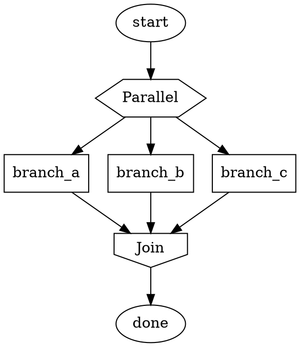

# Parallelism

The pipeline supports concurrent execution of independent branches using the parallel/fan-in handler pair.

## Parallel Handler (shape=hexagon)

A `parallel` node fans execution out to multiple branches simultaneously:



### Context Cloning

When the parallel handler executes:

1. The current context is **cloned** for each outgoing branch
2. Each branch receives an independent copy
3. Branches execute concurrently with no shared mutable state
4. Each branch can modify its context copy freely

### Branch Identification

Each branch's context clone gets a `_branch_id` key identifying which branch it belongs to:

```python
context["_branch_id"] = "branch_a"  # Set automatically by the parallel handler
```

## Fan-In Handler (shape=invhouse)

The `fan_in` node waits for branches to complete and consolidates their results.

### Join Policies

The `join_policy` attribute controls how the fan-in node handles multiple branches:

| Policy | Behavior | Use Case |
|--------|----------|----------|
| `wait_all` | Wait for all branches to complete, regardless of outcome | Default. Need all results. |
| `first_success` | Return as soon as any branch succeeds. Cancel remaining. | Racing multiple approaches. |
| `quorum` | Wait for a majority of branches to succeed | Distributed consensus. |
| `k_of_n` | Wait for k branches to succeed (configurable) | Flexible threshold. |

```dot
join [shape=invhouse join_policy=first_success]
join [shape=invhouse join_policy=k_of_n k=2]
```

### Context Consolidation

At the fan-in point, branch contexts must be merged back into a single context. The consolidation strategy:

1. **Non-conflicting keys**: Merged directly (each branch wrote different keys)
2. **Conflicting keys** (multiple branches wrote the same key):
   - `wait_all` / `quorum`: Last-writer-wins based on completion order
   - `first_success`: Winning branch's values take precedence
   - `k_of_n`: Values from successful branches, last-writer-wins among them
3. **Built-in keys** (`_branch_id`, etc.): Removed from the merged context
4. **Branch results**: Collected into a `_branch_results` map keyed by branch ID

```python
# After fan-in, the merged context contains:
context["_branch_results"] = {
    "branch_a": {"status": "SUCCESS", "module_path": "src/a.py"},
    "branch_b": {"status": "SUCCESS", "module_path": "src/b.py"},
    "branch_c": {"status": "FAILURE", "error": "Tests failed"},
}
```

## Fan-In Outcome

The fan-in node produces an Outcome based on the join policy:

| Policy | SUCCESS when... | FAILURE when... |
|--------|-----------------|-----------------|
| `wait_all` | All branches succeeded | Any branch failed |
| `first_success` | At least one branch succeeded | All branches failed |
| `quorum` | Majority succeeded | Majority failed |
| `k_of_n` | k or more branches succeeded | Fewer than k succeeded |

## Nested Parallelism

Parallel branches can themselves contain parallel/fan-in nodes, creating nested concurrency. Each level of nesting operates independently with its own context cloning and consolidation.

## Checkpointing Parallel Execution

During parallel execution:
- Each branch saves its own checkpoints independently
- The fan-in node's checkpoint includes references to all branch checkpoints
- On resume, all branches resume from their most recent checkpoint

## See Also

- [node-types-and-handlers.md](node-types-and-handlers.md) — Parallel and fan-in handler descriptions
- [state-and-context.md](state-and-context.md) — Context store thread safety
- [execution-engine.md](execution-engine.md) — How parallel branches integrate with the traversal loop
- [../02-coding-agent-loop/subagents.md](../02-coding-agent-loop/subagents.md) — Agent-level concurrency
