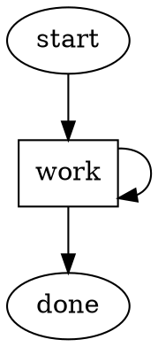

# DOT Syntax Quick Reference

Compact reference card for the Graphviz DOT subset used by Attractor.

## Graph Declaration

```dot
digraph pipeline_name {
    graph [title="My Pipeline" version="1.0"]
    // nodes and edges
}
```

## Node Declaration

```dot
node_name [attribute=value attribute2="value with spaces"]
```

### Node Attributes

| Attribute | Values | Required | Description |
|-----------|--------|----------|-------------|
| `shape` | `ellipse`, `box`, `diamond`, `hexagon`, `invhouse`, `house`, `component`, `tab` | No (default: `box`) | Handler type |
| `goal` | string | For codergen | Task description |
| `label` | string | No | Display name |
| `goal_gate` | `true` | No | Critical success gate |
| `max_retries` | integer | No | Retry limit |
| `retry_target` | node ID | No | Where to route on retry |
| `retry_backoff` | `none`, `linear`, `exponential`, `aggressive` | No | Backoff strategy |
| `class` | string | No | Model stylesheet class |
| `fidelity` | `full`, `compact`, `summary:low`, `summary:medium`, `summary:high` | No | Context fidelity |
| `timeout` | integer (seconds) | No | Execution timeout |
| `join_policy` | `wait_all`, `first_success`, `quorum`, `k_of_n` | No | Fan-in join policy |

### Shape-to-Handler Mapping

| Shape | Handler | Purpose |
|-------|---------|---------|
| `ellipse` | terminal | Start/exit node |
| `box` | codergen | LLM coding agent (default) |
| `diamond` | conditional | Routing-only |
| `hexagon` | parallel | Fan-out to branches |
| `invhouse` | fan_in | Wait for branches |
| `house` | wait.human | Human decision point |
| `component` | tool | Direct tool execution |
| `tab` | stack.manager_loop | Sub-pipeline/loop |

## Edge Declaration

```dot
source -> target [attribute=value]
```

### Chained Edges

```dot
a -> b -> c     // Declares a→b and b→c
```

### Edge Attributes

| Attribute | Type | Description |
|-----------|------|-------------|
| `condition` | string | Expression evaluated against outcome |
| `label` | string | Display label / accelerator key source |
| `weight` | integer | Selection priority (higher = preferred) |
| `fidelity` | string | Context fidelity for this transition |

## Subgraphs

```dot
subgraph cluster_name {
    label = "Group Name"
    node_a [shape=box goal="..."]
    node_b [shape=box goal="..."]
    node_a -> node_b
}
```

The `cluster_` prefix triggers visual grouping in Graphviz rendering.

## Graph-Level Attributes

```dot
graph [
    title="Pipeline Title"
    version="1.0"
    model_stylesheet="styles.css"
    default_fidelity=compact
    fallback=error_handler
]
```

## Variable Expansion

```dot
node [goal="Implement $feature_name in $language"]
```

Variables resolve from the context store at execution time.

## Condition Expression Syntax

```
status == 'SUCCESS'
status != 'FAILURE'
retry_count < 3
confidence >= 0.8
status == 'FAILURE' AND retryable == true
error_message CONTAINS 'timeout'
NOT has_errors
```

See [condition-expressions.md](condition-expressions.md) for the full grammar.

## Minimal Pipeline Example



## See Also

- [../01-pipeline-orchestrator/graph-definition.md](../01-pipeline-orchestrator/graph-definition.md) — Full explanation of graph structure
- [condition-expressions.md](condition-expressions.md) — Condition expression details
